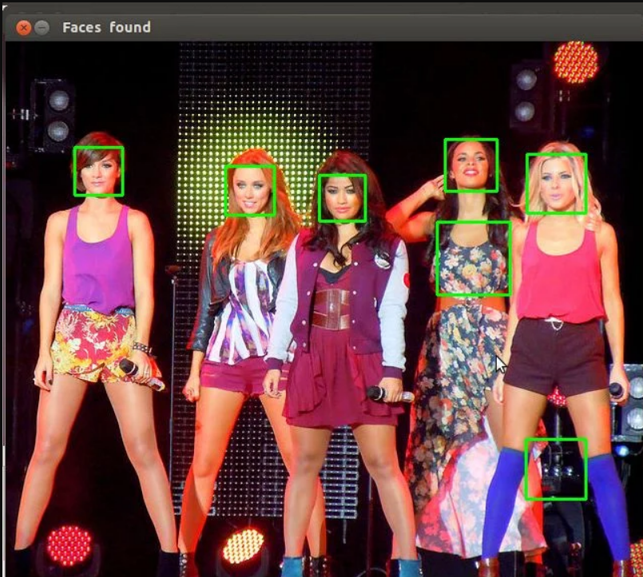

# face-recognition-in-python3
python3 program to detect face in the pictures.

<h2>Modules needed to use this program.</h2> 
pip3 install cv2 
pip3 install tensorflow 
pip3 install cvlib 
pip3 install matplotlib 

<h2>Sample result</h2>

